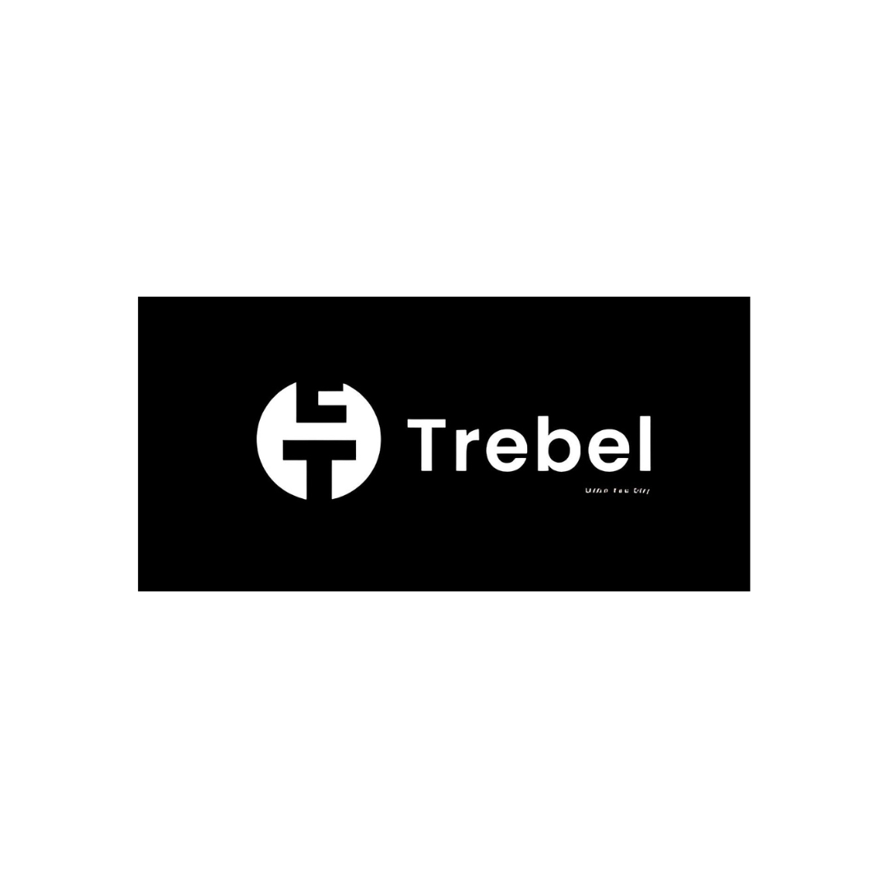
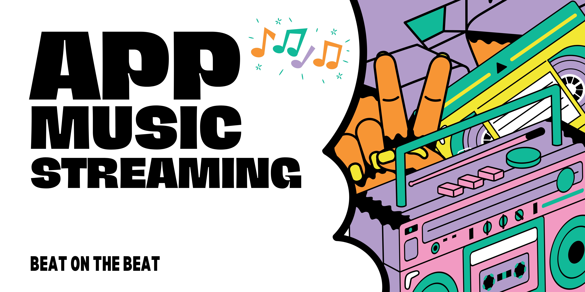
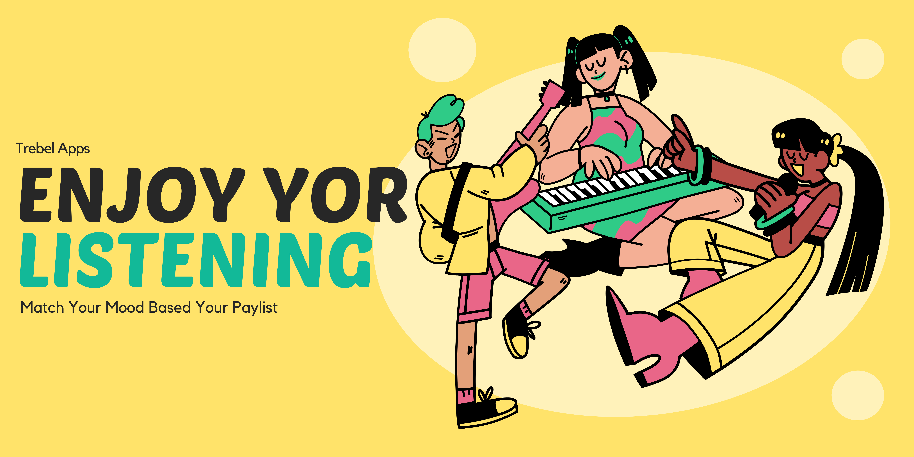
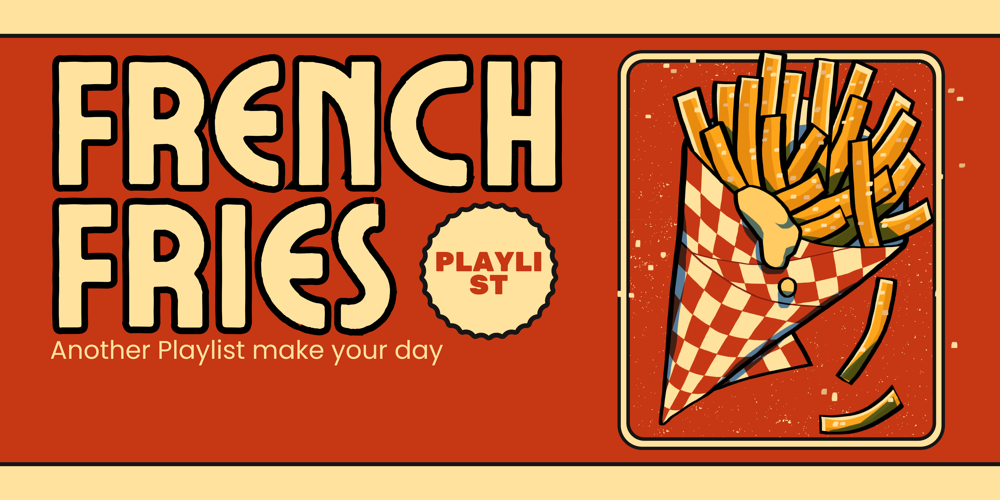
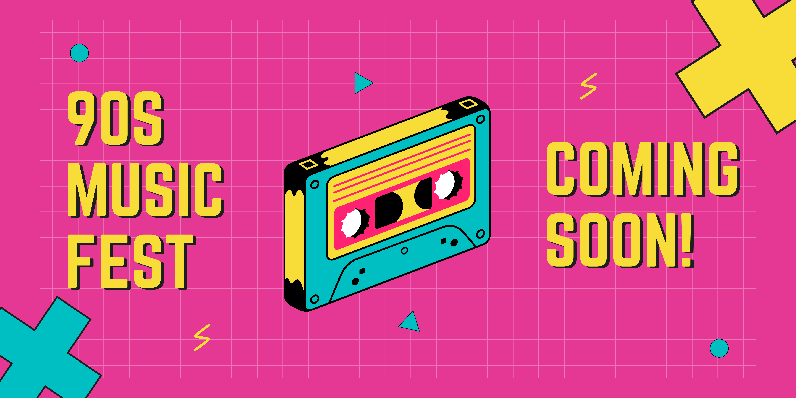

# Trebel

<!-- 

Brighten up your day with music 😎 -->

## Welcome to Trebel

Welcome to **Trebel**, your ultimate destination for an unparalleled music streaming experience! 🎶 Whether you're at home 🏠, on the go 🚀, or anywhere in between 🌍, Trebel lets you enjoy your favorite tunes anytime, anywhere. 🎧 Dive into a world where music meets convenience and let the rhythm move you. 🎵

 <!-- Ganti dengan path ke banner Anda -->

### What's Trebel?

Trebel is your ultimate music streaming app, designed to keep the vibes high and the music flowing. Whether you're chilling at home, working out, or on the go, Trebel has got you covered. With Trebel, you can:

 <!-- Ganti dengan path ke gambar yang sesuai -->

- **Stream unlimited music** for free 🎵
- **Download songs** and listen offline 📲
- **Discover new tracks** tailored to your taste 🎧
- **Enjoy high-quality audio** that makes every beat count 🎶

Say goodbye to boring moments and hello to a world of endless musical possibilities! 🌟

### Why Choose Trebel?

At Trebel, we believe music is more than just a background noise – it's a way of life. Here are some reasons why Trebel should be your go-to music streaming app:

🎵 **Feel the Beat, Anytime, Anywhere!**  
Music isn't just about listening – it's about feeling. With Trebel, you get a personalized music experience that fits your lifestyle. Our intuitive interface and user-friendly features make it easy to find your groove and keep it going. Plus, with our offline mode, the music never stops, even when the signal does.

🌟 **Discover Your Soundtrack**  
Trebel offers a world of music at your fingertips. From the latest hits to classic tunes, find songs that match your vibe. Feeling happy, sad, or ready to party? We've got playlists for every mood! 🎉

🔥 **Join the Music Revolution**  
Become part of the Trebel community and connect with fellow music lovers. Share your favorite tracks, explore new genres, and stay updated with exclusive content. Music is better when shared! ❤️

Relax with Trebel, where every song is a new adventure. Whether you're winding down after a long day, getting pumped for a workout, or setting the mood for a special occasion, Trebel has the perfect playlist for you.

 <!-- Ganti dengan path ke gambar yang sesuai -->

## Features

Celebrate your relaxing, happy, and even sad moments with our awesome features ✨:

- **Add Playlist**: Create and manage your own playlists.
- **Like Playlist**: Show love to your favorite playlists ❤️.
- **Podcast**: Tune in to various podcasts 🎙️.
- **Music Player**: Enjoy a seamless music playing experience 🎵.
- **Podcast Player**: Dedicated player for all your podcast needs 🎧.
- **Music Stories**: Discover the stories behind the music 📖.
- **Lyrics**: Sing along with your favorite songs 🎤.
- **Offline Mode**: Download and listen to music offline 📲.
- **Equalizer**: Customize the sound with our advanced equalizer 🎚️.
- **Curated Playlists**: Enjoy playlists curated by our music experts 🎶.
- **Social Sharing**: Share your favorite tracks and playlists with friends 🌐.
- **Mood-Based Playlists**: Playlists that match your current mood 😊😢😎.

Isn't that awesome?

 <!-- Ganti dengan path ke gambar yang sesuai -->

## Join the Trebel Community

🎉 **Join the Trebel Community** 🎉

Hey, let's connect on social media! Stay in the loop with my latest tracks, playlists, and exclusive content. I'm not just a music app developer – I'm part of a community of music lovers, and I want you to be part of it too! 🌟

### What's in the Trebel Community?

In the Trebel community, you can:

- **Discover New Music**: Be the first to know about the latest tracks and albums.
- **Exclusive Content**: Access behind-the-scenes stories, interviews, and more.
- **Interactive Playlists**: Collaborate with other music lovers to create the perfect playlists.
- **Live Events**: Join live listening parties, Q&A sessions, and virtual concerts.
- **Music Challenges**: Participate in fun challenges and win exciting prizes.
- **Feedback & Suggestions**: Share your thoughts and help shape the future of Trebel.

### Follow Me on Social Media

Connect with me on social media and stay updated with my latest activities, tracks, playlists, and exclusive content. Let's build a vibrant community of music lovers together! 🌟

- [Instagram](https://www.instagram.com/khklif/?hl=en) 📸
- [Twitter](https://x.com/tanyakanrl?ref_src=twsrc%5Egoogle%7Ctwcamp%5Eserp%7Ctwgr%5Eauthor)🐤
- [Discord](https://discord.com/channels/@me)👻
- [thread](https://www.threads.net/@__arpn?hl=en)🪶

Feel free to reach out if you have any questions or just want to chat. [Follow my incredible mentor](https://github.com/sodikihwan), see you around! 🤗

 <!-- Ganti dengan path ke gambar yang sesuai -->

---

So, what are you waiting for? 🚀 Dive into the world of Trebel and let the music take you away. 🎧 Whether you're a casual listener or a hardcore audiophile, Trebel is the perfect app to satisfy your musical cravings. Here’s why you’ll love Trebel:

- **Unlimited Streaming**: No more limits! Stream all the music you love, whenever you want. 🎵
- **Offline Listening**: Going off the grid? No problem! Download your favorite tracks and enjoy them anywhere. 📲
- **Personalized Recommendations**: Discover new music tailored just for you. It’s like having your own personal DJ! 🎧
- **High-Quality Audio**: Hear every beat, every note, and every word in stunning clarity. 🎶
- **Exclusive Content**: Get access to exclusive tracks, behind-the-scenes content, and more. 🎤
- **Vibrant Community**: Join a community of music lovers, share your playlists, and connect with like-minded people. 🌐

🌟 **Why Trebel Rocks** 🌟

Trebel isn’t just another music app. It’s a revolution in how you experience music. Imagine having a world of music in your pocket, ready to set the mood, inspire your workouts, or wind down your evenings. With Trebel, music is more than just sound – it’s a lifestyle.

✨ **Join Us in the Music Revolution** ✨

Become a part of the Trebel community and transform the way you listen to music. Whether you’re exploring new genres, creating the perfect playlist, or enjoying exclusive content, Trebel makes every moment a musical adventure. Ready to elevate your music game?

🚀 **Download Trebel Now** 🚀

Don’t miss out on the ultimate music experience. Download Trebel now and start your musical journey with us! With Trebel, every beat, every track, and every moment is a step towards a new adventure. Are you ready to make every day a musical masterpiece?

Trebel – Where every moment is a musical adventure 🎶

